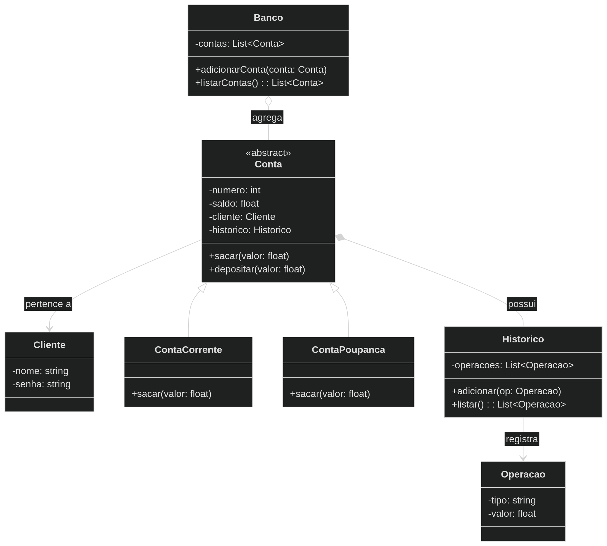

# Entidades

A seguir serão apresentados as entidades do sistema, cada uma com seus comportamentos.
No final desse documento será apresentado um diagrama UML para demonstrar de forma visual
as entidades de negócio do projeto.

## Cliente

Titular das contas criadas.

Campos:
- Nome
- Senha

## Conta

Idealização do conceito geral de uma conta. Será dividida
em conta corrente e conta poupança.

Campos:
- Número da conta
- Saldo
- Titular da conta
- Histórico de operações

Comportamentos:
- Sacar
- Depositar

As especializações de conta podem conter comportamentos distintos para as mesmas ações.

### Conta corrente

Saques na conta corrente terão uma taxa de 5.50.

## Conta poupança

Saques na conta poupança serão isentas de taxa.

## Operação

Armazenará os dados de uma operação. Cada operação será armazenada no
histórico de uma conta.

Dados:
- Tipo de operação (saque ou depósito)
- Valor usado na operação

## Histórico

Responsável por armazenar o histórico das operações realizadas.

Dados:
- Lista das operações realizadas

Comportamentos:
- Registrar uma operação
- Listar operações realizadas

## Banco

Representará um banco qualquer que terá várias contas associadas.

Dados:
- Lista de contas

Comportamentos:
- Adicionar conta
- Listar contas

## Diagrama UML

